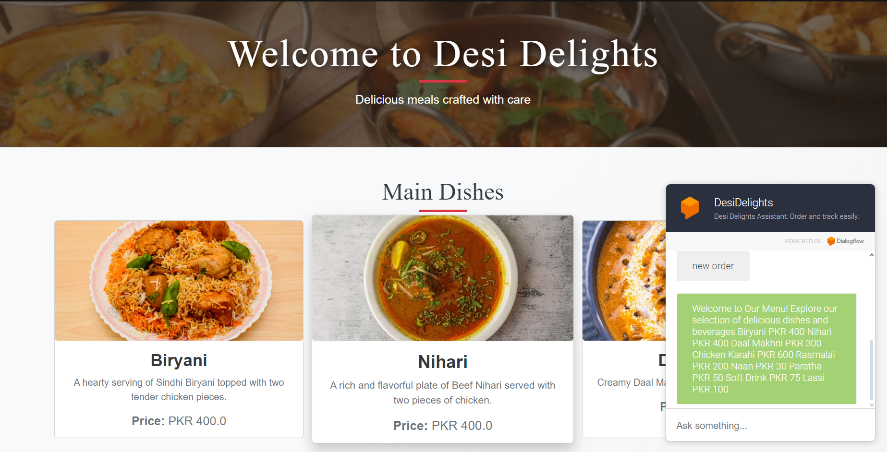
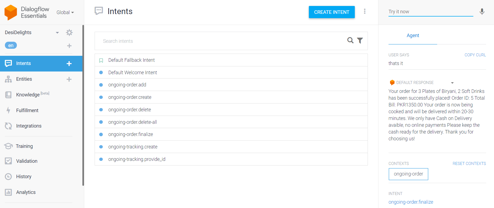

# __Desi Delights - Online Chatbot Resturant with FastAPI and PostgreSQL Database__


## Summary
This project is a full-stack chatbot solution for Desi Delights, a restaurant that allows customers to browse the menu of Pakistani Cuisinr, place orders, and track their status. 

The frontend is built using HTML, Bootstrap, and Jinja2 for dynamic content rendering, while the backend is powered by FastAPI and PostgreSQL for efficient API communication. 

DialogFlow manages natural language processing for seamless interaction 

## Features
### 1. Order Creation: 
Handled by the chatbot: Start a new order, add or remove items, and finalize your order.
### 2. Menu Assistance: 
Handled by the menu page: Browse the menu page and view all the dishes offered and their details.
### 3. Order Tracking: 
Handled by the chatbot: Get real-time updates on your order status, and details

## Technologies
1. Dialogflow
2. PostgreSQL
3. FastAPI
4. Ngrok
5. Jinja2
6. HTML/CSS
7. Bootstrap

## Replicate the Project
The project was inspired by [CodeBasics: Build a Chatbot in Dialogflow](https://www.youtube.com/watch?v=2e5pQqBvGco&list=PLeo1K3hjS3uuvuAXhYjV2lMEShq2UYSwX&index=34)


### Clone the repository:

```
git clone https://github.com/AyeshaNaime003/DesiDelights.git
```

### PostgreSQL Database

#### <u>1. Install PostgreSQL and pgAdmin</u>:

Download and install PostgreSQL and pgAdmin from their official websites.
[Download PostgreSQL and PGadmin4](https://www.postgresql.org/download/)

#### <u>2. Create a Database</u>:

Open pgAdmin and create a new database named `desi_delights`.

Right-click on the desi_delights database, open the `Query Tool`, and copy and paste the script from `db/desi_delight.sql` into the Query Tool. 

Run the query. You should see output like this:

``` 
NOTICE:  table "menu_items" does not exist, skipping
NOTICE:  table "orders" does not exist, skipping
NOTICE:  table "orders_details" does not exist, skipping
NOTICE:  function get_price_for_item() does not exist, skipping
NOTICE:  function get_id_for_item() does not exist, skipping
CREATE FUNCTION

Query returned successfully in 70 msec.
``` 
__Note: feel free to change the menu items or anything else you want in the `db/desi_delight.sql` file__

### Set Up the Dialogflow Chatbot
DialogFlow will handle two features: 
- Order Creation 
- Order Tracking 

(Menu browsing will be done using the menu page)

#### <u>1. Sign in to Dialogflow:</u>
Go to the Dialogflow Console, and sign in with your Google account.

#### <u>2. Create a New Agent:</u>
In the left sidebar, click on the dropdown menu next to "Dialogflow" and select Create New Agent.

Name your agent (e.g., DesiDelights), choose a default language (e.g., English), and set the time zone.

#### <u>3. Enable Fulfillment (Optional but needed for more complex behavior):</u>

Navigate to ```Fulfillment``` on the left panel and enable ```Webhook```. This will allow your chatbot to interact with the FastAPI app we will build later.


#### <u>4. Creating a New Intent:</u>
In the left menu, click Intents. Click the + Create Intent button.

Give your intent a descriptive name, since each intent will be part of a context, naming them using `context-name:detail` would be descriptive and a good standard

_What are Contexts?
Contexts are used to carry information across multiple interactions. For example, while a user is adding items to an order, the bot will need to remember the order information until the process is complete._

- __Ongoing Order__: This context is for making a new order, adding/removing items, and finalizing the order.
Contexts:
    - ongoing-order.new
    - ongoing-order.add
    - ongoing-order.remove
    - ongoing-order.finalize

- __Ongoing Tracking__: This context is for tracking the user's order.
    - ongoing-tracking.provide-id

Implement Dialogflow Fulfillment:

#### <u>5.Add Training Phrases for the intents:</u> 
_Training phrases are sample sentences users might say to trigger this intent_ For example:
```
ongoing-order.create: “Can I place an order?”, “I'd like to order”.

ongoing-order.add: “Add biryani to my order”, “I want to add naan”, “Can I add a dessert?”

ongoing-order.delete: “Remove the naan”, “Take the drink out”, “I don't want the fries”.
```
#### <u>6. Set Default Responses for intents that dont need smart responses form FastAPI: </u>
_Default responses are what your chatbot will say when this intent is triggered._
```
Hi: Hello, Would You Like to place an order or track an existing one?

bcfeiobeib: Oops! I didn't catch that. You can either place an order from our delicious items such as biryani, chicken karahi, nihari, daal makhni, naan, paratha, jalebi, ras malai, cold drink, or lassi, or check on an order you already placed. How can I assist you?
```

#### <u>7.Use Entities for Smarter Responses:</u>
_Entities allow Dialogflow to extract specific information from the user's input (e.g., items like biryani, naan, drinks)._

To create an entity for food items, go to Entities in the left menu and click + Create Entity. Name the entity (e.g., ```MenuItem```) and provide examples like biryani, naan, drink and their synonyms.

Now, when you set up training phrases in the ongoing-order.add intent, you can highlight the food item word and mark it as a ```MenuItem``` entity.

### Set Up FastAPI App
#### <u>1. Create a virtual environment in ```server``` directory and insall the dependencies</u>
``` bash
python -m venv env
.\env\Scripts\activate
pip install -r requirements.txt
```
#### <u>2. Create an .env file for database configuration in the ```server``` directory</u>
``` bash
DATABASE_HOST="host" 
DATABASE_USER="user" 
DATABASE_NAME="database" 
DATABASE_PASSWORD="password"
```
#### <u>2. Run the FastAPI locally: </u>
``` bash
uvicorn main:app --reload
```
__Note: main.py holds all the endpoints and additional functions to handle the endpoint logics. It also sets up the templates and static directories for frontend__

### Use Ngrok to secure the FastAPI URL:
#### <u>1. Download Ngrok:</u>
Download Ngrok for your operating system, extract it, and copy ngrok.exe to the ```server``` directory (the same location as your .env file).
#### <u>2. Create an Account:</u>
Sign up for an Ngrok account and obtain your authentication token. Save it in ```ngrok.yml``` in the server directory:
```yml
authtoken: your_token_here
```
#### <u>3. Secure Your HTTP Port using the following command:</u>
```bash
DesiDelights\server> ngrok http 8000 --config=./ngrok.yml
```
You will see something like:
```
Session Status online                                                                             
Account username_name (Plan)                                                                 
Version 3.16.1                                                                                    
Region India (in)                                                                                
Web Interface  http://127.0.0.1:4040                                                                     
Forwarding  https://fafb-188-50-186-132.ngrok-free.app -> http://localhost:8000
```
#### 4. Add the secure URL to Dialog's Flow Fullfillment URL


### Frontend
The frontend is implemented using ```Jinja2``` for rendering dynamic content and includes static assets like CSS and images.

Single Page Application: There is only one page that displays the restaurant’s menu, along with an integrated chatbot for placing and tracking orders.

- Jinja2 Templates:
    - templates/index.html: 
The main HTML file that shows the menu and interacts with the chatbot.
- Static Files:
    - static/style/main.css: Contains all the custom styles for the website.
    - static/assets/: Stores images used for displaying menu item